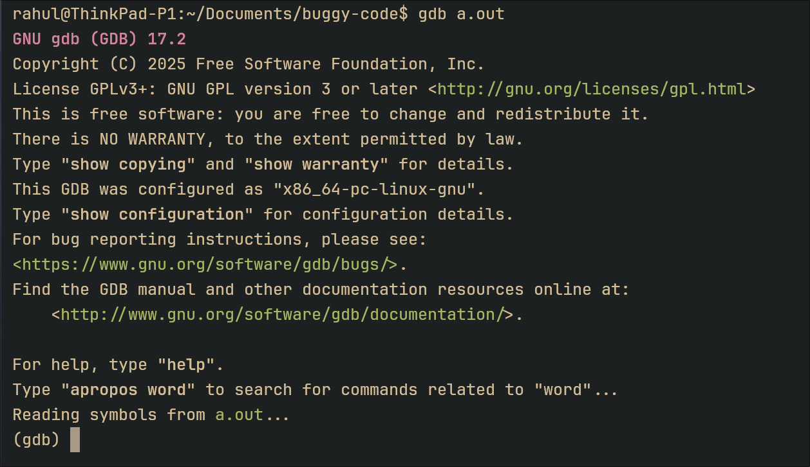

<!-- font_size: 6 -->
<!-- jump_to_middle -->

# **How To Debug in C**

<!-- alignment: right -->
<!-- font_size: 2 -->

_with Rahul Reji_
<!-- end_slide -->

<!-- jump_to_middle -->
<!-- alignment: center -->
<!-- font_size: 3-->

What are the types of
errors you encounter in a C program?
<!-- end_slide-->

<!-- font_size: 3-->

1. Compile-time errors

<!--pause-->
<!-- font_size: 1-->
<!-- new_lines: 3-->

```c {2-7}
$ gcc joseph.c
exclaim.c: In function ‘main’:
exclaim.c:12:28: error: passing argument 1 of ‘square’ makes integer from pointer without a cast [-Wint-conversion]
   12 |     printf("%d \n", square("abc"));
      |                            ^~~~~
      |                            |
      |                            char *
exclaim.c:3:16: note: expected ‘int’ but argument is of type ‘char *’
    3 | int square(int n) {
      |            ~~~~^
```

<!--pause-->
<!-- alignment: center -->

This one is a "type error". `square` expects an integer, but got a character pointer instead
<!-- end_slide -->

<!-- new_lines: 3 -->

```c
$ gcc world.c
world.c: In function ‘main’:
world.c:4:14: error: implicit declaration of function ‘malloc’ [-Wimplicit-function-declaration]
    4 |     int* x = malloc(50);
      |              ^~~~~~
world.c:2:1: note: include ‘<stdlib.h>’ or provide a declaration of ‘malloc’
    1 | #include <stdio.h>
  +++ |+#include <stdlib.h>
world.c:4:14: note: include ‘<stdlib.h>’ or provide a declaration of ‘malloc’
```

<!-- alignment: left -->
<!-- font_size: 2-->
The compiler is quite helpful, it usually tells you how to fix most compile-time errors.
<!-- end_slide-->

<!-- font_size: 3 -->

### What exactly causes a segmentation fault?

<!-- new_lines: 2 -->
<!-- font_size: 2 -->

> A segmentation fault is a failure caused when a process attempts to access a memory segment that it is not allowed to access.

<!-- end_slide -->

<!-- font_size: 5 -->

#### The GNU Debugger
<!-- newline-->
<!-- font_size: 2 -->
To run a program via GDB, first compile it using the `-g` flag. 
```bash
$ gcc main.c -g
```
then launch GDB providing the executable as an argument: 
```bash
$ gdb ./a.out
```
<!-- end_slide -->

<!-- font_size: 2-->

It will look somewhat like this: 

<!-- font_size: 2-->
If it says "Reading symbols from `a.out`", that means you compiled it correctly and are fine to proceed.
<!--font_size:1 ->
<!-- newline-->
If it says "No debugging symbols found", that means you forgot the `-g` flag while compiling.
<!--end_slide-->

<!-- font_size: 4-->
### Setting a breakpoint
<!-- font_size: 2-->
A breakpoint pauses your program whenever a particular point in the program is reached. You can decide where this should be. This allows you to check values of intermediary variables while the execution is halted.

## Usage:
1. `b [line number]`: Halts execution right before that line
2. `b [function name]`: Halts execution when that function is entered

<!--newline-->
> When GDB stops at "line 5", this means that gdb is currently waiting "between" lines 4 and 5. Line 5 hasn't executed yet. Keep this in mind! You can execute line 5 with the next command, but line 5 has not happened yet.
<!-- end_slide-->

<!-- font_size: 3-->
### Where do I put breakpoints?
<!-- font_size: 2-->
It comes with practice. While starting out, use `b main` and run through every line of your code. As you begin to get 
more used to GDB, you'll sort of get an idea of where to put them. For example, instead of `b main`, you can move the breakpoint
down until you read input. Or, instead of `main`, choose a function that you suspect isn't working correctly.
<!-- newline-->
Once you have chosen your breakpoint, run it using the `run` command. The program will now start normal execution, and pause when
the breakpoint is encountered.
<!-- newline-->
> To quit GDB, use "quit" or "q"
<!-- end_slide-->

<!-- font_size: 4-->
### Inspecting variables
<!-- font_size: 2-->
The `print` (shorthand `p`) can be used to inspect values of variables.
To use- `print [identifier name]` 

It works on basically everything- integers, arrays, strings and structures, and supports C syntax like dereferencing (*) and structure pointer dereferencing (->) operators

For strings, by default it prints the character array until `\0` is encountered. If you want to print the first n characters instead you can use `print mystring@n`

Example: `mystring@50` prints the first 50 characters starting at address `mystring`.

<!-- end_slide-->
<!-- font_size: 4-->
### Watchpoints
<!-- font_size: 2-->
You can use a watchpoint to stop execution whenever the value of an expression changes, without having to predict a particular place where this may happen.

## Usage:
`watch [identifier]`: GDB will now break whenever the identifier is written into by the program and its value changes.
<!-- end_slide-->

<!-- font_size: 4-->
### Continuing Execution Flow 
<!-- font_size: 2-->
1. `next` (shorthand: `n`)

Runs the current line and goes to the immediately next line.

2. `step` (shorthand: `s`)

Runs the current line, and if there aren't any function calls in the current line- goes to the next line.

If there are any function calls, goes INTO the function's definition and halts there.

<!-- font_size: 2-->
3. `continue` (shorthand: `c`)

Runs until the next breakpoint

<!-- end_slide -->
<!--font_size: 3-->
### Other useful commands
<!--font_size: 2-->
1. `layout src`: Shows the source code alongside the GDB prompt. 
> This layout is sometimes prone to slight screen glitches. Remember to press `Ctrl+L` to refresh the screen every time something looks unusual.
2. `list`: Shows the source code centered to where you currently are.
3. `info locals`: Shows all variables in the current scope, and their values.
4. `set variable [variable name] = [value]`: Changes the value of a variable on the fly
<!-- end_slide -->

<!--font_size: 3-->
### Van-Eck Sequence
<!-- font_size: 2-->

The Van-Eck sequence starts at 0. If the previous term is a "new term" (not in the sequence), the next term is 0. 

If the previous term already is in the sequence, the next term is the "distance to the previous term". As in: 

```latex +render
$$ \quad a_n = \begin{cases} 0 & \text{if } a_{n-1} \notin \{a_0, \dots, a_{n-2}\} \\ (n-1) - \max\{k < n-1 : a_k = a_{n-1}\} & \text{otherwise} \end{cases} $$
```

```latex +render
  (0, 0, 1, 0, 2, 0, 2, 2, 1, 6, 0, 5, 0, 2, 6, 5, 4, 0, 5, 3)
```

<!-- alignment: center -->
<!-- font_size: 2-->
##### Write a program to find the nth term of the Van-Eck sequence.
